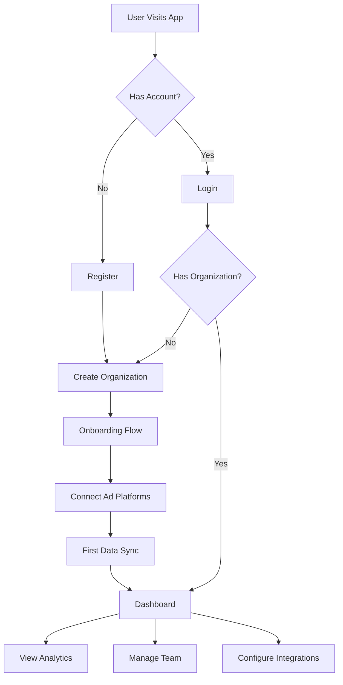

# ClearLift User Onboarding Guide

## Overview

This guide explains how to onboard new users to the ClearLift platform in production. ClearLift is a multi-tenant SaaS analytics platform that helps businesses track and analyze their marketing data across multiple advertising platforms.

## User Journey Flow



## API Endpoints for Onboarding

### 1. User Registration

**Endpoint:** `POST /v1/auth/register`

```bash
curl -X POST https://api.clearlift.ai/v1/auth/register \
  -H "Content-Type: application/json" \
  -d '{
    "email": "user@example.com",
    "password": "SecurePassword123!",
    "name": "John Doe",
    "organization_name": "Acme Corp"
  }'
```

**Response:**
```json
{
  "success": true,
  "data": {
    "user": {
      "id": "uuid",
      "email": "user@example.com",
      "name": "John Doe"
    },
    "session": {
      "token": "session_token_here",
      "expires_at": "2025-11-16T00:00:00Z"
    },
    "organization": {
      "id": "org_uuid",
      "name": "Acme Corp",
      "slug": "acme-corp"
    }
  }
}
```

### 2. User Login

**Endpoint:** `POST /v1/auth/login`

```bash
curl -X POST https://api.clearlift.ai/v1/auth/login \
  -H "Content-Type: application/json" \
  -d '{
    "email": "user@example.com",
    "password": "SecurePassword123!"
  }'
```

**Response:**
```json
{
  "success": true,
  "data": {
    "user": {
      "id": "uuid",
      "email": "user@example.com",
      "name": "John Doe"
    },
    "session": {
      "token": "session_token_here",
      "expires_at": "2025-11-16T00:00:00Z"
    },
    "organizations": [
      {
        "id": "org_uuid",
        "name": "Acme Corp",
        "slug": "acme-corp",
        "role": "owner"
      }
    ]
  }
}
```

### 3. Start Onboarding

**Endpoint:** `GET /v1/onboarding/status`

```bash
curl -X GET https://api.clearlift.ai/v1/onboarding/status \
  -H "Authorization: Bearer session_token_here"
```

This automatically initializes onboarding if not started.

### 4. Connect Ad Platforms

Users can connect their advertising platforms via OAuth:

#### Google Ads
```bash
curl -X POST https://api.clearlift.ai/v1/connectors/google/connect \
  -H "Authorization: Bearer session_token_here" \
  -H "Content-Type: application/json" \
  -d '{
    "organization_id": "org_uuid",
    "redirect_uri": "https://app.clearlift.ai/onboarding/callback"
  }'
```

#### Facebook Ads
```bash
curl -X POST https://api.clearlift.ai/v1/connectors/facebook/connect \
  -H "Authorization: Bearer session_token_here" \
  -H "Content-Type: application/json" \
  -d '{
    "organization_id": "org_uuid",
    "redirect_uri": "https://app.clearlift.ai/onboarding/callback"
  }'
```

#### Stripe (API Key)
```bash
curl -X POST https://api.clearlift.ai/v1/connectors/stripe/connect \
  -H "Authorization: Bearer session_token_here" \
  -H "Content-Type: application/json" \
  -d '{
    "organization_id": "org_uuid",
    "api_key": "sk_live_...",
    "name": "Production Stripe Account"
  }'
```

### 5. Complete Onboarding Steps

Mark each onboarding step as complete:

```bash
curl -X POST https://api.clearlift.ai/v1/onboarding/complete-step \
  -H "Authorization: Bearer session_token_here" \
  -H "Content-Type: application/json" \
  -d '{
    "step_name": "connect_services"
  }'
```

Steps:
- `welcome` - User has seen welcome screen
- `connect_services` - User has connected at least one service
- `first_sync` - First data sync completed

## Team Management

### Invite Team Members

Organization owners/admins can invite team members:

```bash
curl -X POST https://api.clearlift.ai/v1/organizations/{org_id}/invite \
  -H "Authorization: Bearer session_token_here" \
  -H "Content-Type: application/json" \
  -d '{
    "email": "teammate@example.com",
    "role": "viewer"
  }'
```

Roles:
- `viewer` - Can view data only
- `admin` - Can manage connections and settings
- `owner` - Full control including billing

### Join Organization

Users can join an organization with an invite code:

```bash
curl -X POST https://api.clearlift.ai/v1/organizations/join \
  -H "Authorization: Bearer session_token_here" \
  -H "Content-Type: application/json" \
  -d '{
    "invite_code": "ABC123"
  }'
```

## Complete Onboarding Flow

Here's the recommended sequence for a new user:

1. **Register Account**
   - User signs up with email/password
   - Organization is created automatically (optional)
   - Session token is returned

2. **Initial Setup**
   - Check onboarding status
   - Complete welcome step

3. **Connect Data Sources** (at least one)
   - Google Ads (OAuth)
   - Facebook Ads (OAuth)
   - Stripe (API Key)
   - TikTok Ads (coming soon)

4. **Wait for First Sync**
   - Cron worker runs every 15 minutes
   - Initial data pull can take 5-30 minutes
   - User can trigger manual sync if needed

5. **Access Dashboard**
   - View unified analytics
   - Configure filters and settings
   - Invite team members

## Environment-Specific URLs

### Production
- API: `https://api.clearlift.ai`
- App: `https://app.clearlift.ai`

### Development
- API: `http://localhost:8787`
- App: `http://localhost:3000`

## Error Handling

Common error codes:

- `400` - Invalid request data
- `401` - Authentication required
- `403` - Permission denied
- `409` - Resource already exists (duplicate email, etc.)
- `429` - Rate limit exceeded
- `500` - Internal server error

## Rate Limits

- Authentication endpoints: 5 requests per 15 minutes
- Analytics endpoints: 20 requests per minute
- Standard endpoints: 100 requests per minute

## Security Best Practices

1. **Password Requirements**
   - Minimum 8 characters
   - Mix of letters, numbers, symbols recommended
   - Stored using PBKDF2 with SHA-256

2. **Session Management**
   - Sessions expire after 30 days
   - Tokens should be stored securely
   - Use refresh endpoint to rotate tokens

3. **Organization Security**
   - Each org has isolated data
   - Role-based access control
   - Audit logs for all actions

## Email Notifications (To Be Implemented)

The following emails will be sent:

1. **Welcome Email** - After registration
2. **Email Verification** - Confirm email address
3. **Password Reset** - When requested
4. **Invitation** - When invited to organization
5. **First Sync Complete** - Data ready notification

## Support

For issues or questions:
- Documentation: https://docs.clearlift.ai
- Support: support@clearlift.ai
- Status: https://status.clearlift.ai

## Next Steps for Production

1. **Email Service Integration**
   - Set up SendGrid/Postmark for transactional emails
   - Configure email templates
   - Add email verification flow

2. **Payment Integration**
   - Stripe checkout for subscriptions
   - Usage-based billing for API calls
   - Seat management for team plans

3. **Enhanced Security**
   - Two-factor authentication
   - SSO integration (SAML/OAuth)
   - IP allowlisting for enterprise

4. **Analytics**
   - User behavior tracking
   - Conversion funnel analysis
   - Feature usage metrics

---

**Last Updated**: October 2025
**API Version**: 1.0.0